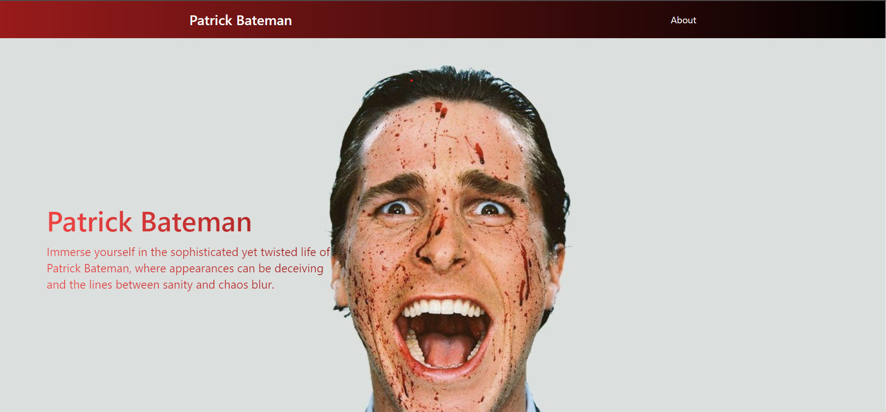

# Patrick Bateman's Portfolio Website



Welcome to Patrick Bateman's Portfolio Website! This is a sophisticated yet twisted platform showcasing the life, skills, and interests of the enigmatic character, Patrick Bateman. Through this website, you'll gain insights into Patrick's meticulously crafted image, his impeccable taste, and his complex personality. Explore the world of high finance, luxury, and intrigue in the heart of New York City.

## Table of Contents

- [Introduction](#patrick-batemans-portfolio-website)
- [Features](#features)
- [Technologies Used](#technologies-used)
- [Installation](#installation)
- [Usage](#usage)
- [Contributing](#contributing)
- [License](#license)

## Features

- **Hero Section:** Engage with the captivating hero section, where Patrick Bateman's character comes to life through an animated image and intriguing tagline.
- **About Section:** Delve into the depths of Patrick's personality, exploring his qualities, strengths, and weaknesses in a visually appealing and informative manner.
- **Music Player:** Immerse yourself in Patrick's world by listening to his favorite music through a beautifully designed music player library.
- **Navbar:** Navigate seamlessly between different sections of the website using the stylish and user-friendly navigation bar.

## Technologies Used

This portfolio website is built using the MERN stack (MongoDB, Express, React, Node.js) combined with other modern web development technologies and tools:

- **Frontend:** React for building dynamic user interfaces.
- **Backend:** Express and Node.js for creating a robust server.
- **Database:** MongoDB for storing data related to Patrick Bateman's portfolio.
- **Styling:** Tailwind CSS for responsive and elegant styling.
- **Animations:** CSS animations and transitions for engaging user interactions.
- **Audio:** Incorporation of audio elements to enhance the user experience.
- **Deployment:** Deployment using platforms like Heroku and MongoDB Atlas.

## Installation

1. Clone this repository to your local machine using:

   ```bash
   git clone https://github.com/dhruvalgupta2003/Patrick-Bateman-Portfolio.git
   ```

2. Navigate to the project directory:

   ```bash
   cd patrick-bateman-portfolio
   ```

3. Install the required dependencies for both the frontend and backend:

   ```bash
   cd frontend
   npm install
   cd ../backend
   npm install
   ```

## Usage

1. Make sure MongoDB is running and accessible.
2. Start the backend server:

   ```bash
   cd backend
   npm start
   ```

3. Start the frontend development server:

   ```bash
   cd frontend
   npm start
   ```

4. Open your web browser and navigate to [http://localhost:3000](http://localhost:3000) to explore Patrick Bateman's Portfolio Website.

## Contributing

Contributions are welcome! Feel free to submit issues or pull requests to enhance the website. Please follow the standard guidelines for contribution.

## License

This project is licensed under the [MIT License](LICENSE).

---

Designed and developed with passion by Dhruval Gupta. All rights reserved.
